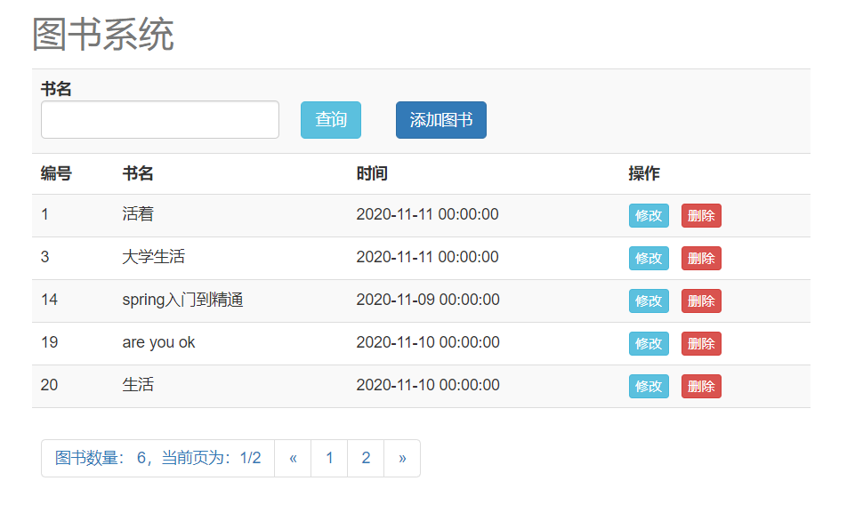

## 图书管理系统

### 简介

这是一个非常简单的图书管理系统，主要对图书的展示和增删改查操作

### 界面



### 主要功能

- 展示所有的图书信息
- 添加单个图书信息
- 删除单个图书信息
- 修改单个图书信息

### 技术模块

- 前端主要用html，css，JavaScript，jQuery，bootstrap，jquery，Vue
- 后端是采用javaEE开发的后端平台，spring，springMVC，mybatis，springBoot，mysql

### 后台接口

library文件就是后台服务的原文件

接口可参考swagger访问：http://localhost:8080/swagger-ui.html

#### books

作用：获取所有的图书信息

传入参数：无

返回值：数组，每个元素都是一个books对象

#### addBook

作用：添加图书

传入参数：books对象，但只需要其中的name属性值

返回值：result对象

#### isExist

作用：判断传入的图书名是否存在

传入参数：String name

返回值：result对象

#### findBookById

作用：通过图书id获取图书对象信息

传入参数：integer id 图书对象的id

返回值：result对象

#### editBookById

作用：通过图书id修改图书信息

传入参数：books 对象

返回值：result对象

#### deleteBookById

作用：通过图书id删除图书

传入参数：integer id 图书id

返回值：result对象

#### findBooksByName

作用：分页加模糊查询

传入参数：name 图书名 pageNum 分页的当前页

返回值：BooksPage对象主要是分页的数据，加总页数，总记录数

#### Books类

```java
package com.gec.books.pojo;

import java.io.Serializable;
import java.util.Date;

public class Books implements Serializable {
    private Integer id;

    private String name;

    private Date time;

    private static final long serialVersionUID = 1L;

    public Integer getId() {
        return id;
    }

    public void setId(Integer id) {
        this.id = id;
    }

    public String getName() {
        return name;
    }

    public void setName(String name) {
        this.name = name;
    }

    public Date getTime() {
        return time;
    }

    public void setTime(Date time) {
        this.time = time;
    }

    @Override
    public String toString() {
        StringBuilder sb = new StringBuilder();
        sb.append(getClass().getSimpleName());
        sb.append(" [");
        sb.append("Hash = ").append(hashCode());
        sb.append(", id=").append(id);
        sb.append(", name=").append(name);
        sb.append(", time=").append(time);
        sb.append(", serialVersionUID=").append(serialVersionUID);
        sb.append("]");
        return sb.toString();
    }
}
```

#### Result类

```java
package com.gec.books.pojo;

/**
 * 此类是一个返回操作信息的类
 */
public class Result {
    // 用于表示添加、删除、修改 是否成功，true表示成功，false表示失败
    private boolean isSuccess;
    // 用于返回提示信息
    private String message;
    // 用户返回可能会用到的数据
    private Object  data;

    public boolean isSuccess() {
        return isSuccess;
    }

    public void setSuccess(boolean success) {
        isSuccess = success;
    }

    public String getMessage() {
        return message;
    }

    public void setMessage(String message) {
        this.message = message;
    }

    public Object getData() {
        return data;
    }

    public void setData(Object data) {
        this.data = data;
    }

    @Override
    public String toString() {
        return "Result{" +
                "isSuccess=" + isSuccess +
                ", message='" + message + '\'' +
                ", data=" + data +
                '}';
    }
}

```

#### BooksPage类

```java
package com.gec.books.pojo;

import java.util.List;

public class BooksPage {

    private List<Books> books;

    private Long total;

    private Integer pages;

    @Override
    public String toString() {
        return "BooksPage{" +
                "books=" + books +
                ", total=" + total +
                ", pages=" + pages +
                '}';
    }

    public List<Books> getBooks() {
        return books;
    }

    public void setBooks(List<Books> books) {
        this.books = books;
    }

    public Long getTotal() {
        return total;
    }

    public void setTotal(Long total) {
        this.total = total;
    }

    public Integer getPages() {
        return pages;
    }

    public void setPages(Integer pages) {
        this.pages = pages;
    }
}

```


### MySQL

mysql文件夹下的library_system.sql文件是数据库数据

